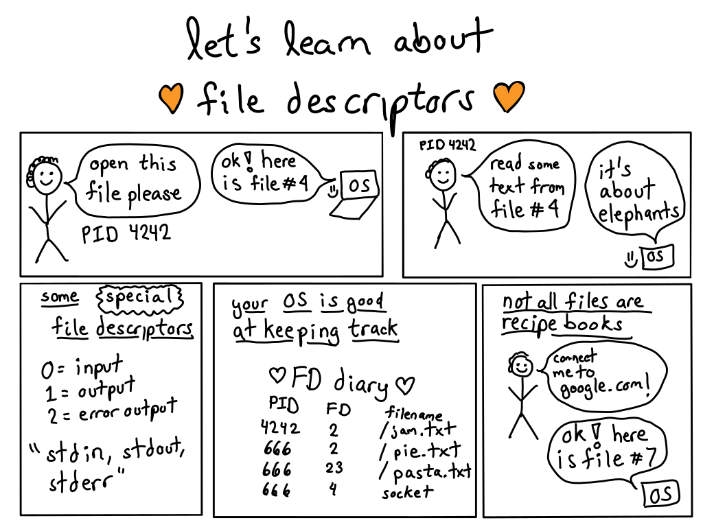

# 进程，第1部分：简介

## 概观

进程是正在运行的程序（有点）。进程也只是该计算机程序运行的一个实例。进程有很多东西可供他们使用。在每个程序开始时，您将获得一个进程，但每个程序可以创建更多进程。实际上，您的操作系统只启动了一个进程，所有其他进程都是分开的 - 所有这些都是在启动时在引擎盖下完成的。

## 在一开始的时候

当您的操作系统在Linux机器上启动时，会创建一个名为`init.d`的进程。该进程是处理信号，中断和某些内核元素的持久性模块的特殊进程。无论何时想要创建一个新进程，都可以调用`fork`（将在后面的部分中讨论）并使用另一个函数来加载另一个程序。

## 进程隔离

进程非常强大，但它们是孤立的！这意味着默认情况下，任何进程都无法与另一个进程通信。这非常重要，因为如果你有一个大型系统（比方说EWS），那么你希望某些进程拥有比普通用户更高的特权（监控，管理员），并且当然不希望普通用户能够带来通过修改进程有意或无意地整个系统。

如果我运行以下代码，

```
int secrets; //maybe defined in the kernel or else where
secrets++;
printf("%d\n", secrets); 
```

在两个不同的终端上，正如你猜测的那样，它们都打印出1而不是2.即使我们改变了代码来做一些真正的hacky（除了直接读取内存），也没有办法改变另一个进程的状态（好吧）也许[这](https://en.wikipedia.org/wiki/Dirty_COW)，但这有点太深入了）。

## 进程内容

## 内存布局


当进程启动时，它会获得自己的地址空间。意味着每个进程得到（对于内存

*   **一个堆栈**。堆栈是存储自动变量和函数调用返回地址的位置。每次声明一个新变量时，程序都会向下移动堆栈指针以保留变量的空间。堆栈的这一部分是可写的但不可执行。如果堆栈增长得太远（意味着它增长超出预设边界或与堆相交），您将获得堆栈溢出，最有可能导致SEGFAULT或类似的东西。 **默认静态分配堆栈意味着只能写入一定数量的空间**
*   **堆**。堆是一个扩展的内存区域。如果你想分配一个大对象，它就在这里。堆从文本段的顶部开始向上增长（有时当你调用`malloc`它要求操作系统向上推动堆边界时）。此区域也是可写但不可执行。如果系统受限制或者地址耗尽（在32位系统上更常见），则可能会耗尽堆内存。
*   **数据段**包含所有全局变量。此部分从Text段的末尾开始，并且大小是静态的，因为在编译时已知全局变量。这部分是可写的但不是可执行的，这里没有其他任何东西太过花哨。
*   **文本段**。可以说，这是地址中最重要的部分。这是存储所有代码的地方。由于汇编编译为1和0，因此这是存储1和0的地方。程序计数器通过该段执行指令并向下移动下一条指令。请务必注意，这是代码中唯一的可执行部分。如果您尝试在运行时更改代码，很可能会出现段错误（有很多方法可以解决它但只是假设它是段错误的）。
*   为什么不从零开始？它在此类的[范围](https://en.wikipedia.org/wiki/Address_space_layout_randomization)之外，但它是为了安全。

## 文件描述符



正如小小的zine所示，操作系统会跟踪文件描述符及其指向的内容。稍后我们将看到文件描述符不需要指向实际文件，操作系统会为您跟踪它们。另外，请注意，进程之间的文件描述符可以重用，但在进程内部它们是唯一的。

文件描述符也有一个位置概念。您可以完全读取磁盘上的文件，因为操作系统会跟踪文件中的位置，这也属于您的进程。

## 安全/权限

## 进程功能/限制（奖金）

当你正在审查决赛时，你可以回来看看一个进程也有所有这些东西。第一次 - 它没有多大意义。

## 进程ID（PID）

为了跟踪所有这些进程，操作系统为每个进程提供一个编号，该进程称为PID进程ID。

进程也可以包含

*   映射
*   州
*   文件描述符
*   权限