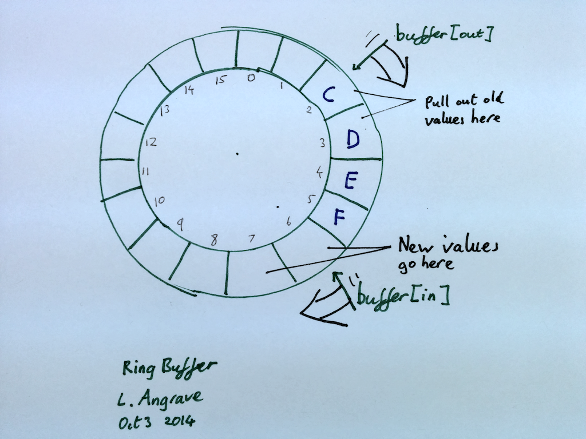

# 同步，第 8 部分：环形缓冲区示例

> 原文：<https://github.com/angrave/SystemProgramming/wiki/Synchronization%2C-Part-8%3A-Ring-Buffer-Example>

## 什么是环形缓冲区？

环形缓冲区是一种简单的，通常是固定大小的存储机制，其中连续内存被视为圆形，两个索引计数器跟踪队列的当前开始和结束。由于数组索引不是循环的，因此当移过数组末尾时，索引计数器必须回绕到零。当数据被添加（入队）到队列的前面或从队列的尾部移除（出队）时，缓冲区中的当前项形成一条似乎环绕轨道的列车一个简单的（单线程）实现如下所示。注意 enqueue 和 dequeue 不会防止下溢或溢出 - 当队列已满时可以添加项目，并且当队列为空时可以删除项目。例如，如果我们将 20 个整数（1,2,3 ...）添加到队列中并且没有使任何项目出列，则值`17,18,19,20`将覆盖`1,2,3,4`。我们现在不会解决这个问题，相反，当我们创建多线程版本时，我们将确保在环形缓冲区满或空时分别阻塞入队和出队线程。

```c
void *buffer[16];
int in = 0, out = 0;

void enqueue(void *value) { /* Add one item to the front of the queue*/
  buffer[in] = value;
  in++; /* Advance the index for next time */
  if (in == 16) in = 0; /* Wrap around! */
}

void *dequeue() { /* Remove one item to the end of the queue.*/
  void *result = buffer[out];
  out++;
  if (out == 16) out = 0;
  return result;
}
```

## 实现环形缓冲区有什么问题？

以下面的紧凑形式编写入队或出队方法非常诱人（N 是缓冲区的容量，例如 16）：

```c
void enqueue(void *value)
  b[ (in++) % N ] = value;
}
```

这种方法似乎有效（通过简单的测试等），但包含一个微妙的 bug。有足够的入队操作（超过 20 亿），`in`的 int 值将溢出并变为负值！模数（或“余数”）运算符`%`保留符号。因此，您最终可能会写入`b[-14]`！

紧凑的形式是正确的使用位屏蔽，只要 N 是 2 ^ x（16,32,64，...）

```c
b[ (in++) & (N-1) ] = value;
```

此缓冲区尚未阻止缓冲区下溢或溢出。为此，我们将转向我们的多线程尝试，它将阻塞线程，直到有空间或至少有一个项目要删除。

## 检查多线程实现的正确性（示例 1）

以下代码是不正确的实现。会发生什么？ `enqueue`和/或`dequeue`会阻塞吗？相互排斥是否满足？缓冲区可以下溢吗？缓冲区可以溢出吗？为清楚起见，`pthread_mutex`缩短为`p_m`，我们假设 sem_wait 不能被中断。

```c
#define N 16
void *b[N]
int in = 0, out = 0
p_m_t lock
sem_t s1,s2
void init() { 
    p_m_init(&lock, NULL)
    sem_init(&s1, 0, 16)
    sem_init(&s2, 0, 0)
}

enqueue(void *value) {
    p_m_lock(&lock)

    // Hint: Wait while zero. Decrement and return
    sem_wait( &s1 ) 

    b[ (in++) & (N-1) ] = value

    // Hint: Increment. Will wake up a waiting thread 
    sem_post(&s1) 
    p_m_unlock(&lock)
}
void *dequeue(){
    p_m_lock(&lock)
    sem_wait(&s2)
    void *result = b[(out++) & (N-1) ]
    sem_post(&s2)
    p_m_unlock(&lock)
    return result
}
```

## 分析

在阅读之前，看看你能找到多少错误。然后确定如果线程调用 enqueue 和 dequeue 方法会发生什么。

*   enqueue 方法在同一个信号量（s1）上等待和发布，类似于 equeue 和（s2），即我们递减值然后立即递增值，所以在函数结束时信号量值不变！
*   s1 的初始值为 16，因此信号量永远不会减少到零 - 如果环形缓冲区已满，则 enqueue 不会阻塞 - 因此溢出是可能的。
*   s2 的初始值为零，因此对 dequeue 的调用将始终阻塞并且永不返回！
*   需要交换互斥锁和 sem_wait 的顺序（但是这个例子很破坏，这个 bug 没有效果！）##检查多线程实现的正确性（例 1）

The following code is an incorrect implementation. What will happen? Will `enqueue` and/or `dequeue` block? Is mutual exclusion satisfied? Can the buffer underflow? Can the buffer overflow? For clarity `pthread_mutex` is shortened to `p_m` and we assume sem_wait cannot be interrupted.

```c
void *b[16]
int in = 0, out = 0
p_m_t lock
sem_t s1, s2
void init() {
    sem_init(&s1,0,16)
    sem_init(&s2,0,0)
}

enqueue(void *value){

 sem_wait(&s2)
 p_m_lock(&lock)

 b[ (in++) & (N-1) ] = value

 p_m_unlock(&lock)
 sem_post(&s1)
}

void *dequeue(){
  sem_wait(&s1)
  p_m_lock(&lock)
  void *result = b[(out++) & 15]
  p_m_unlock(&lock)
  sem_post(&s2)

  return result;
}
```

### 分析

*   s2 的初始值为 0.因此，即使缓冲区为空，enqueue 也会在第一次调用 sem_wait 时阻塞！
*   s1 的初始值为 16.因此即使缓冲区为空，dequeue 也不会在第一次调用 sem_wait 时阻塞 - oops 下溢！ dequeue 方法将返回无效数据。
*   该代码不满足互斥;两个线程可以同时修改`in`或`out`！该代码似乎使用互斥锁。不幸的是锁从未用`pthread_mutex_init()`或`PTHREAD_MUTEX_INITIALIZER`初始化 - 所以锁可能不起作用（`pthread_mutex_lock`可能什么都不做）

## 正确实现环形缓冲区

伪代码（`pthread_mutex`缩短为`p_m`等）如下所示。

由于互斥锁存储在全局（静态）内存中，因此可以使用`PTHREAD_MUTEX_INITIALIZER`进行初始化。如果我们为堆上的互斥锁分配了空间，那么我们就会使用`pthread_mutex_init(ptr, NULL)`

```c
#include <pthread.h>
#include <semaphore.h>
// N must be 2^i
#define N (16)

void *b[N]
int in = 0, out = 0
p_m_t lock = PTHREAD_MUTEX_INITIALIZER
sem_t countsem, spacesem

void init() {
  sem_init(&countsem, 0, 0)
  sem_init(&spacesem, 0, 16)
}
```

入队方法如下所示。注意：

*   锁定仅在关键部分（访问数据结构）期间保持。
*   由于 POSIX 信号，完整的实现需要防止`sem_wait`的早期返回。

```c
enqueue(void *value){
 // wait if there is no space left:
 sem_wait( &spacesem )

 p_m_lock(&lock)
 b[ (in++) & (N-1) ] = value
 p_m_unlock(&lock)

 // increment the count of the number of items
 sem_post(&countsem)
}
```

`dequeue`实现如下所示。请注意同步调用`enqueue`的对称性。在这两种情况下，如果空格计数或项目数为零，则函数首先等待。

```c
void *dequeue(){
  // Wait if there are no items in the buffer
  sem_wait(&countsem)

  p_m_lock(&lock)
  void *result = b[(out++) & (N-1)]
  p_m_unlock(&lock)

  // Increment the count of the number of spaces
  sem_post(&spacesem)

  return result
}
```

## 值得深思

*   如果交换`pthread_mutex_unlock`和`sem_post`调用的顺序会发生什么？
*   如果交换`sem_wait`和`pthread_mutex_lock`调用的顺序会发生什么？