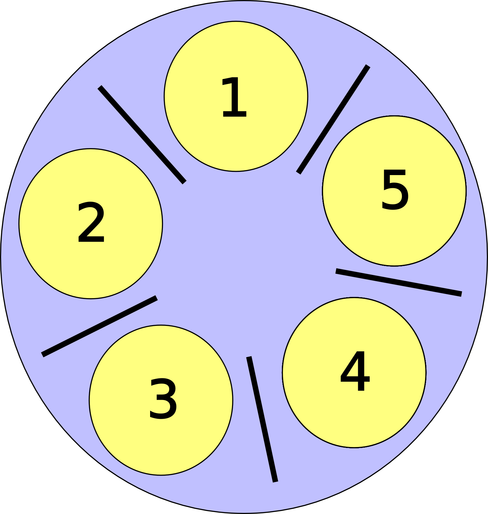

# 死锁，第 2 部分：死锁条件

> 原文：<https://github.com/angrave/SystemProgramming/wiki/Deadlock%2C-Part-2%3A-Deadlock-Conditions>

## 科夫曼的条件

有四个 _ 必需 _ 和 _ 充分 _ 条件的死锁。这些被称为科夫曼条件。

*   相互排斥
*   循环等待
*   等等
*   没有先发制人

如果你破坏其中任何一个，你就不会陷入僵局！

所有这些条件都是死锁所必需的，所以让我们依次讨论每个条件。首先是简单的 -

*   相互排斥：无法共享资源
*   循环等待：资源分配图中存在一个循环。存在一组进程{P1，P2，...}，使得 P1 正在等待 P2 所持有的资源，其等待 P3，...，等待 P1。
*   保持和等待：进程获取一组不完整的资源，并在等待其他资源时保留它们。
*   没有先发制人：一旦进程获得了资源，就无法从进程中获取资源，并且进程不会自愿放弃资源。

## 打破科夫曼条件

两名学生需要一支笔和纸：

*   学生们分享笔和纸。避免死锁，因为不需要互斥。
*   学生们都同意在拿纸之前抓住笔。避免死锁，因为不能进行循环等待。
*   学生们在一次操作中抓住笔和纸（“得到两个或得不到”）。因为没有 _ 保持和等待 _ 而避免死锁
*   学生是朋友，会互相要求放弃持有的资源。避免死锁是因为允许抢占。

## 活锁

活锁是 _ 而不是 _ 死锁 -

考虑以下“解决方案”

*   如果学生在 10 秒内无法获取其他资源，他们将放下一个持有的资源。该解决方案避免了死锁，但是它可能遭受活锁。

当进程继续执行但无法取得进展时会发生 Livelock。实际上可能会发生 Livelock，因为程序员已采取措施避免死锁。在上面的示例中，在繁忙的系统中，学生将不断释放第一个资源，因为他们永远无法获得第二个资源。系统没有死锁（学生进程仍在执行），但它也没有取得任何进展。

## 死锁预防/避免与死锁检测

死锁预防确保不会发生死锁，这意味着你打破了 coffman 条件。这在单个程序中是最好的，软件工程师可以选择打破某个 coffman 条件。考虑[银行家的算法](https://en.wikipedia.org/wiki/Banker's_algorithm)。它是另一种避免死锁的算法。整个实现超出了本课程的范围，只知道操作系统有更多通用算法。

另一方面，死锁检测允许系统进入死锁状态。进入后，系统会使用它所具有的信息来打破僵局。例如，考虑访问文件的多个进程。操作系统能够通过某种级别的文件描述符（通过 API 或直接抽象）跟踪所有文件/资源​​。如果操作系统在操作系统文件描述符表中检测到定向循环，则可能会中断一个进程（例如通过调度）并让系统继续运行。

## 餐饮哲学家

Dining Philosophers 问题是一个经典的同步问题。想象一下，我邀请 N（让我们说 5 位）哲学家吃饭。我们将坐在一张桌子上，用五根筷子（每个哲学家之间一个）。哲学家在想要吃饭或思考之间交替。吃饭的哲学家必须在他们的位置两侧拾起两根筷子（原始问题要求每个哲学家都有两把分叉）。然而，这些筷子与他的邻居分享。

是否有可能设计出一种有效的解决方案，使所有哲学家都能吃到它？或者，一些哲学家会挨饿，从未获得第二根筷子吗？或者他们都会陷入僵局？例如，想象每个客人拿起他们左边的筷子，然后等待他们右边的筷子自由。糟糕 - 我们的哲学家陷入僵局！