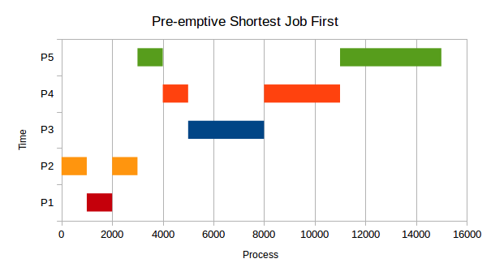
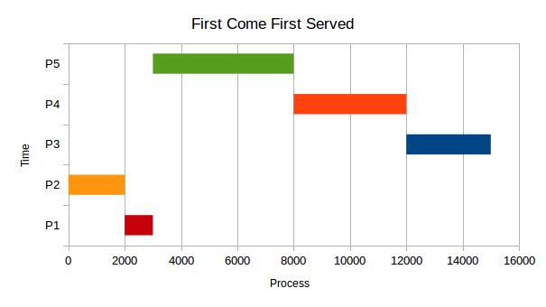

# 调度，第 2 部分：调度过程：算法

> 原文：<https://github.com/angrave/SystemProgramming/wiki/Scheduling%2C-Part-2%3A-Scheduling-Processes%3A-Algorithms>

## 什么是众所周知的调度算法？

对于所有的例子，

过程 1：运行时 1000ms

过程 2：运行时 2000ms

过程 3：运行时 3000ms

过程 4：运行时 4000ms

过程 5：运行时 5000ms

## 最短的工作优先（SJF）

*   P1 到达：0ms
*   P2 到达：0ms
*   P3 到达：0ms
*   P4 到达：0ms
*   P5 到货：0ms

这些进程都在开始时到达，并且调度程序以最短的总 CPU 时间调度作业。明显的问题是这个调度程序需要知道该程序在运行程序之前将持续运行多长时间。

技术说明：实际的 SJF 实现不会使用进程的总执行时间，而是使用突发时间（包括将来计算执行之前的总 CPU 时间将不再准备好运行）。可以通过使用基于先前突发时间的指数衰减加权滚动平均来估计预期突发时间，但是对于该展示，我们将简化该讨论以使用该过程的总运行时间作为突发时间的代理。

**优势**

*   较短的工作往往先运行

**缺点**

*   需要算法是无所不知的

## 抢先最短的工作优先（PSJF）

先抢先最短的作业首先是最短的作业，但是如果新作业的运行时间短于过程的剩余运行时间，则运行该作业。 （如果它与我们的算法相同，我们的算法可以选择）。调度程序使用进程的总运行时间，如果你想剩下最短 _ 剩余 _ 时间，那就是 PSJF 的变体，称为 Shortest Remaining Time First。

*   P2 在 0ms
*   P1 在 1000ms
*   P5 在 3000ms
*   P4 在 4000ms
*   P3 在 5000ms

这是我们的算法所做的。它运行 P2 因为它是唯一运行的东西。然后 P1 进入 1000ms，P2 运行 2000ms，所以我们的调度程序先发制人地停止 P2，让 P1 一直运行（这完全取决于算法因为时间相等）。然后，P5 进入 - 由于没有进程正在运行，调度程序将运行进程 5.P4 进入，并且由于运行时间等于 P5，调度程序停止 P5 并运行 P4。最后 P3 进入，抢占 P4，并运行完成。然后 P4 运行，然后 P5 运行。

**Advantages**

*   确保较短的工作首先运行

**Disadvantages**

*   需要再次了解运行时

**注意：**此算法因历史原因比较总运行时间 _ 而非 _ 剩余运行时间。如果您想考虑剩余时间，您将使用抢先最短剩余时间优先（PSRTF）。

## 先到先得（FCFS）

*   P2 在 0ms
*   P1 在 1000ms
*   P5 在 3000ms
*   P4 在 4000ms
*   P3 在 5000ms

流程按到达顺序安排。 FCFS 的一个优点是调度算法很简单：就绪队列只是一个 FIFO（先进先出）队列。 FCFS 遭遇康宏效应。

在这里 P2 到达，然后 P1 到达，然后是 P5，然后是 P4，然后是 P3。你可以看到 P5 的护航效果。

**Advantages**

*   简单的实施

**Disadvantages**

*   长时间运行的进程可以阻止所有其他进程

## Round Robin（RR）

进程按其到达就绪队列的顺序进行安排。但是，经过一小段时间后，将强制从运行状态中删除正在运行的进程并将其放回就绪队列。这可确保长时间运行的进程不会使所有其他进程无法运行。进程在返回就绪队列之前可以执行的最长时间称为时间量。在大时间量子点（时间量子长于所有过程的运行时间）的限制下，循环将等同于 FCFS。

*   P1 到达：0ms
*   P2 到达：0ms
*   P3 到达：0ms
*   P4 到达：0ms
*   P5 到货：0ms

量子= 1000ms

这里所有流程都在同一时间到达。 P1 运行 1 个量程并完成。 P2 为一个量子;然后，P3 停止了。在为量子运行所有其他进程之后，我们循环回到 P2，直到完成所有进程。

**Advantages**

*   确保一些公平的概念

**Disadvantages**

*   大量进程=大量切换

## 优先

进程按优先级顺序排列。例如，导航过程执行可能比记录过程更重要。