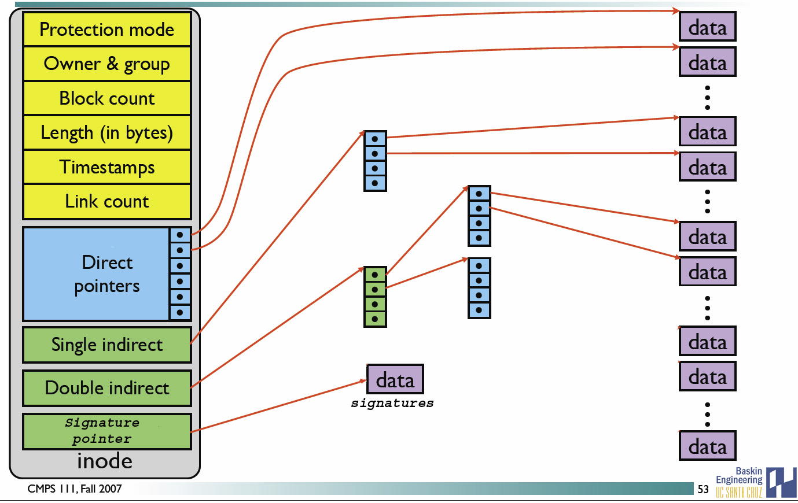

# 文件系统，第 1 部分：简介

> 原文：<https://github.com/angrave/SystemProgramming/wiki/File-System%2C-Part-1%3A-Introduction>

## 导航/术语

## 设计一个文件系统！你的设计目标是什么？

文件系统的设计是一个难题，因为我们希望满足许多高级设计目标。一份不完整的理想目标清单包括：

*   可靠且强大（即使由于功率损耗导致硬件故障或写入不完整）
*   访问（安全）控件
*   会计和配额
*   索引和搜索
*   版本控制和备份功能
*   加密
*   自动压缩
*   高性能（例如内存缓存）
*   有效使用存储重复数据删除

并非所有文件系统本身都支持所有这些目标。例如，许多文件系统不会自动压缩很少使用的文件

## 什么是`.`，`..`和`...`？

在标准的 unix 文件系统中：

*   `.`代表当前目录

*   `..`代表父目录

*   `...`不是任何目录的有效表示（这不是祖父目录）。它 _ 可以 _ 然而是磁盘上文件的名称。

## 什么是绝对和相对路径？

绝对路径是从目录树的“根节点”开始的路径。相对路径是从树中当前位置开始的路径。

## 有什么相对和绝对路径的例子？

如果从主目录开始（简称“〜”），那么`Desktop/cs241`将是一个相对路径。它的绝对路径对应可能类似于`/Users/[yourname]/Desktop/cs241`。

## 如何简化`a/b/../c/./`？

请记住，`..`表示“父文件夹”，`.`表示“当前文件夹”。

示例：`a/b/../c/./`

*   第 1 步：`cd a`（在 a 中）
*   第 2 步：`cd b`（在 a / b 中）
*   第 3 步：`cd ..`（在 a 中，因为..表示'父文件夹'）
*   第 4 步：`cd c`（在 a / c 中）
*   第 5 步：`cd .`（在/ c 中，因为。表示'当前文件夹'）

因此，该路径可以简化为`a/c`。

## 什么是文件系统？

文件系统是如何在磁盘上组织信息。每当您想要访问文件时，文件系统都会指示如何读取文件。这是文件系统的示例图像。

哇，这让我们分手了

*   超级块：此块包含有关文件系统，大小，上次修改时间，日志，inode 数量和第一个 inode 启动，数据块数量和第一个数据块启动的元数据。
*   Inode：这是关键的抽象。 inode 是一个文件。
*   磁盘块：这些是存储数据的位置。文件的实际内容

## inode 如何存储文件内容？

来自[维基百科](http://en.wikipedia.org/wiki/Inode)：

> _ 在 Unix 风格的文件系统中，索引节点（非正式地称为 inode）是用于表示文件系统对象的数据结构，该文件系统对象可以是各种事物之一，包括文件或目录。每个 inode 都存储文件系统对象数据的属性和磁盘块位置。文件系统对象属性可以包括操纵元数据（例如，改变，访问，修改时间），以及所有者和许可数据（例如，组 ID，用户 ID，许可）。_

要读取文件的前几个字节，请按照第一个间接块指针指向第一个间接块并读取前几个字节，写入是相同的过程。如果你想读取整个文件，继续阅读直接块，直到你的大小用完（我们将讨论一些间接块）

> “计算机科学中的所有问题都可以通过另一层次的间接解决。” - 大卫惠勒

## 为什么要使磁盘块与内存页面大小相同？

为了支持虚拟内存，我们可以在内存中填充内容。

## 我们想为每个文件存储哪些信息？

*   文件名
*   文件大小
*   创建时间，上次修改，上次访问
*   权限
*   文件路径
*   校验
*   文件数据（inode）

## 传统权限是什么：用户 - 组 - 文件的其他权限？

一些常见的文件权限包括：

*   755：`rwx r-x r-x`

user：`rwx`，组：`r-x`，其他：`r-x`

用户可以读，写和执行。小组和其他人只能阅读和执行。

*   644：`rw- r-- r--`

user：`rw-`，组：`r--`，其他：`r--`

用户可以读写。小组和其他人只能阅读。

## 每个角色的常规文件的 3 个权限位是什么？

*   读（最重要的位）

*   写（第 2 位）

*   执行（最低有效位）

## “644”“755”是什么意思？

这些是八进制格式的权限示例（基数 8）。每个八进制数字对应不同的角色（用户，组，世界）。

我们可以按如下方式读取八进制格式的权限：

*   644 - R / W 用户权限，R 组权限，R 世界权限

*   755 - R / W / X 用户权限，R / X 组权限，R / X 世界权限

## 你可以在每个间接表中存储多少个指针？

作为一个有效的例子，假设我们将磁盘划分为 4KB 块，并且我们想要寻址最多 2 ^ 32 个块。

最大磁盘大小为 4KB * 2 ^ 32 = 16TB（记住 2 ^ 10 = 1024）

磁盘块可以存储 4KB / 4B（每个指针需要 32 位）= 1024 个指针。每个指针指的是一个 4KB 磁盘块 - 因此您可以参考最多 1024 * 4KB = 4MB 的数据

对于相同的磁盘配置，双间接块存储 1024 个指向 1024 个间接表的指针。因此，双间接块可以指代最多 1024 * 4MB = 4GB 的数据。

类似地，三重间接块可以指代最多 4TB 的数据。

[转到文件系统：第 2 部分](https://github.com/angrave/SystemProgramming/wiki/File-System,-Part-2:-Files-are-inodes-(everything-else-is-just-data...))