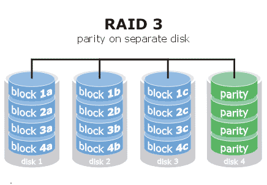
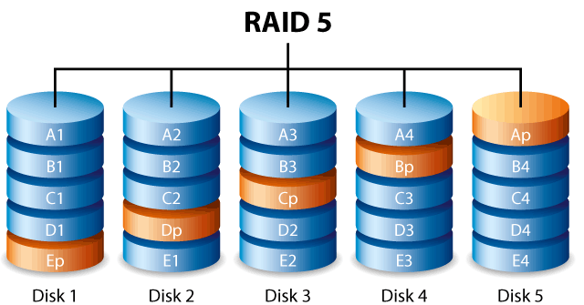

# 文件系统，第 7 部分：可扩展且可靠的文件系统

> 原文：<https://github.com/angrave/SystemProgramming/wiki/File-System%2C-Part-7%3A-Scalable-and-Reliable-Filesystems>

## 可靠的单磁盘文件系统

## 内核如何以及为何缓存文件系统？

大多数文件系统会在物理内存中缓存大量磁盘数据。在这方面，Linux 特别极端：所有未使用的内存都用作巨型磁盘缓存。

磁盘缓存可能会对整体系统性能产生重大影响，因为磁盘 I / O 速度很慢。对于旋转磁盘上的随机访问请求尤其如此，其中磁盘读写延迟由将读写磁盘头移动到正确位置所需的查找时间决定。

为了提高效率，内核会缓存最近使用过的磁盘块。对于写入，我们必须在性能和可靠性之间进行权衡：磁盘写入也可以被缓存（“回写缓存”），其中修改的磁盘块存储在内存中直到被驱逐。或者，可以采用“直写高速缓存”策略，其中磁盘写入立即发送到磁盘。后者更安全（因为文件系统修改很快存储到持久性媒体），但比回写缓存慢;如果缓存写入，则可以根据每个磁盘块的物理位置来延迟和有效地调度它们。

请注意，这是一个简化的描述，因为固态驱动器（SSD）可以用作辅助回写缓存。

在读取或写入顺序数据时，固态磁盘（SSD）和旋转磁盘都具有改进的性能。因此，操作系统通常可以使用预读策略来分摊读取请求成本（例如，旋转磁盘的时间成本）并且每个请求请求几个连续的磁盘块。通过在用户应用程序需要下一个磁盘块之前发出下一个磁盘块的 I / O 请求，可以减少表观磁盘 I / O 延迟。

## 我的数据很重要！我可以强制将磁盘写入保存到物理介质并等待它完成吗？

是的（差不多）。调用`sync`以请求将文件系统更改写入（刷新）到磁盘。但是，并非所有操作系统都遵循此请求，即使数据从内核缓冲区中逐出，磁盘固件也会使用内部磁盘缓存，或者可能尚未完成更改物理介质。

请注意，您还可以请求使用`fsync(int fd)`将与特定文件描述符关联的所有更改刷新到磁盘

## 如果我的磁盘在重要操作过程中出现故障怎么办？

不要担心大多数现代文件系统都会执行一些称为 **journalling** 的工作。文件系统在完成一个可能很昂贵的操作之前所做的是它在日志中写下它将要做什么。在崩溃或失败的情况下，可以单步执行日志并查看哪些文件已损坏并修复它们。这是一种在存在关键数据且没有明显备份的情况下抢救硬盘的方法。

## 磁盘发生故障的可能性有多大？

使用“平均时间故障”测量磁盘故障。对于大型阵列，平均故障时间可能非常短。例如，如果 MTTF（单个磁盘）= 30,000 小时，则 MTTF（100 个磁盘）= 30000/100 = 300 小时，即大约 12 天！

## 冗余

## 如何保护数据免受磁盘故障的影响？

简单！存储数据两次！这是“RAID-1”磁盘阵列的主要原理。 RAID 是廉价磁盘冗余阵列的简称。通过将写入复制到另一个（备份磁盘）的磁盘上，只有两个数据副本。如果一个磁盘发生故障，另一个磁盘将作为唯一的副本，直到可以重新克隆。读取数据的速度更快（因为可以从任一磁盘请求数据）但写入速度可能慢两倍（现在需要为每个磁盘块写入发出两个写入命令），并且与使用单个磁盘相比，每个磁盘的存储成本字节加倍。

另一种常见的 RAID 方案是 RAID-0，这意味着可以将文件拆分为两个磁盘，但如果其中一个磁盘发生故障，则文件将无法恢复。这样可以减少写入时间，因为文件的一部分可以写入硬盘，另一部分写入硬盘 2。

组合这些系统也很常见。如果您有很多硬盘，请考虑使用 RAID-10。这是您有两个 RAID-1 系统的地方，但这些系统相互连接在 RAID-0 中。这意味着您可以从减速速度获得大致相同的速度，但现在任何一个磁盘都可能出现故障，您可以恢复该磁盘。 （如果来自对方 raid 分区的两个磁盘发生故障，则有可能发生恢复，尽管我们大多数时间都无法进行恢复）。

## 什么是 RAID-3？

RAID-3 使用奇偶校验码而不是镜像数据。对于写入的每个 N 位，我们将写入一个额外的位，即“奇偶校验位”，确保写入的 1 的总数是偶数。奇偶校验位写入另一个磁盘。如果任何一个磁盘（包括奇偶校验磁盘）丢失，则仍然可以使用其他磁盘的内容计算其内容。



RAID-3 的一个缺点是，无论何时写入磁盘块，都将始终写入奇偶校验块。这意味着单独的磁盘实际上存在瓶颈。实际上，这更有可能导致故障，因为一个磁盘在 100％的时间内被使用，一旦磁盘出现故障，其他磁盘就更容易出现故障。

## RAID-3 对数据丢失的安全性如何？

单个磁盘故障不会导致数据丢失（因为有足够的数据可以从其余磁盘重建阵列）。当两个磁盘不可用时将发生数据丢失，因为不再有足够的数据来重建阵列。我们可以根据修复时间计算出两个磁盘故障的概率，其中不仅包括插入新磁盘的时间，还包括重建阵列的整个内容所需的时间。

```
MTTF = mean time to failure
MTTR = mean time to repair
N = number of original disks

p = MTTR / (MTTF-one-disk / (N-1)) 
```

使用典型数字（MTTR = 1 天，MTTF = 1000 天，N-1 = 9，p = 0.009

在重建过程中有另外一个驱动器失败的可能性为 1％（此时您最好还是希望您仍然可以访问原始数据。

实际上，修复过程中第二次失败的可能性可能更高，因为重建阵列是 I / O 密集型的（并且在正常的 I / O 请求活动之上）。这种较高的 I / O 负载也会对磁盘阵列造成压力

## 什么是 RAID-5？

RAID-5 类似于 RAID-3，只是将检查块（奇偶校验信息）分配给不同块的不同磁盘。检查块通过磁盘阵列“旋转”。 RAID-5 提供比 RAID-3 更好的读写性能，因为不再存在单奇偶校验磁盘的瓶颈。缺点是您需要更多磁盘才能进行此设置，并且需要使用更复杂的算法



## 分布式存储

失败是常见的情况谷歌报告每年有 2-10％的磁盘发生故障现在在单个仓库中将磁盘数量增加了 60,000 多个...必须经受住不仅仅是磁盘，服务器机架或整个数据中心的故障

解决方案简单冗余（每个文件 2 或 3 个副本），例如，Google GFS（2001）更高效的冗余（类似于 RAID 3 ++），例如 [Google Colossus 文件系统](http://goo.gl/LwFIy)（~2010）：可定制的复制，包括 Reed -Solomon 代码具有 1.5 倍冗余